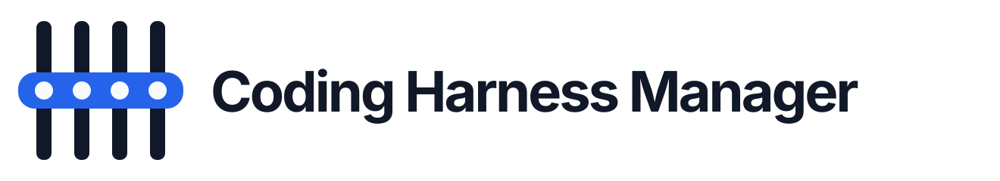

<p align="center">
  
</p>

<h1 align="center">
  <picture>
    <source media="(prefers-color-scheme: dark)" srcset="./resources/logos/logo-dark.svg"/>
    
  </picture>
</h1>

<p align="center">
  <strong>English</strong> · <a href="./README.ko.md">한국어</a>
</p>

<p align="center">
  <a href="./LICENSE"></a>
  <a href="./.github/workflows/ci.yml"></a>
  
  <a href="https://patty.io"></a>
</p>

<h3 align="center">Configure once. Preview the diff. Sync everywhere.</h3>

<p align="center">
  A desktop control plane for the providers, models, MCP servers, skills, and launch profiles<br/>
  scattered across Claude Code, Codex, OpenCode, Pi, Reasonix, and other coding harnesses.
</p>

Coding harnesses are powerful, but every tool keeps its own provider settings,
model aliases, MCP definitions, skills, and config-file syntax. Coding Harness
Manager (CHM) gives those tools a shared library without hiding or replacing
their native files.

Scan what is already installed, import the setup you want to keep, preview a
native diff, and apply only the changes you approve. Every write is backed up
and recorded so you can understand, accept, or roll it back later.

> [!NOTE]
> CHM is currently pre-1.0. Adapter capabilities are surfaced per harness and
> per configuration surface; support is not treated as one all-or-nothing
> checkbox.

## Why use it?

| Without CHM | With CHM |
|---|---|
| Repeat the same provider and model setup in several tools | Keep reusable providers, endpoints, and model routes in one library |
| Remember which model alias belongs to which gateway | Preserve provider identity, endpoint URL, and remote model ID separately |
| Copy MCP servers and skills between incompatible config formats | Detect, group, import, and sync them through harness-aware adapters |
| Edit JSON, JSONC, TOML, and YAML by hand | Preview the intended native change before a library sync |
| Discover an unexpected config change after something breaks | See highlighted drift, accept it, or restore the last CHM baseline |
| Maintain your own backup trail | Get atomic writes, backups, snapshots, descriptive history, and rollback |

## What CHM manages

- **Harness inventory** — executable, version, config path, models, MCP servers,
  skills, writable capabilities, and external drift.
- **Providers and endpoints** — provider identity stays separate from protocol,
  base URL, discovery path, authentication mode, and credential reference.
- **My Models** — reusable model routes with display name, context window, input
  limit, output limit, provider, and endpoint metadata.
- **MCP servers and skills** — detected across harnesses, grouped where they are
  logically the same, and synced only to formats that support them.
- **Profiles and sets** — launch a harness with a selected model, or preview and
  apply a reusable bundle of models, MCP servers, and skills.
- **History and safety** — plans, diffs, backups, snapshots, external-change
  handling, rollback, Doctor diagnostics, and redacted exports.

## Supported harnesses

| Adapter group | Harnesses |
|---|---|
| Primary adapters | Claude Code, Codex, OpenCode, Pi, Reasonix |
| Additional format-aware adapters | Gemini CLI, Qwen Code, Kimi CLI, Cursor, Cline, Roo Code, Aider, Amp, Goose, Continue |

Each adapter reports the native surfaces that its harness actually persists.
For example, one harness may expose a model registry while another exposes only
model selection, MCP, or skills. CHM shows those capability differences in the
app and does not invent unsupported writes.

## How it works

```text
native harness configs
        │
        ▼
  Scan + read-only import ──────► CHM library
                                      │
                                      ▼
                              desired vs. actual
                                      │
                                      ▼
                              plan + native diff
                                      │
                             explicit Apply only
                                      │
                                      ▼
                         atomic write + backup + verify
                                      │
                                      ▼
                               History / rollback
```

Importing an existing setup reads harness files but does not change them. A
library sync follows **Desired → Plan → Preview → Apply → Verify**. Direct
harness edits are separate, confirmed actions and still create backups and
History snapshots.

## Installation

### Download an installer

Open the repository's **Releases** tab and download the published package for
your platform:

| Platform | Packages |
|---|---|
| macOS Apple Silicon | `.dmg` / `.app` (`aarch64`) |
| macOS Intel | `.dmg` / `.app` (`x86_64`) |
| Windows | `.msi` or NSIS `.exe` |
| Linux | `.AppImage` or `.deb` |

See the [installation guide](./docs/installation.md) for platform-specific
notes, including the unsigned-build warning on macOS.

### Run from source

Prerequisites: Rust stable 1.85 or newer, Node.js 22, npm 11+, and the
[Tauri 2 platform dependencies](./docs/development.md) for your operating
system.

```bash
npm ci --prefix apps/desktop
npm run tauri dev --prefix apps/desktop
```

CHM creates its local registry at
`~/.coding-harness-manager/chm.sqlite` on first launch.

## Five-minute quick start

1. Open **Harnesses** and click **Scan machine**.
2. Open **Import existing setup** and review the detected providers, models,
   MCP servers, and skills for each selected harness. Importing here does not
   write to harness files.
3. Open **Providers**, add or review an endpoint, and configure its credential.
4. Click **Discover models**, then add the models you want to **My Models**.
5. Open a harness and choose **Sync from library…**.
6. Select the desired models, review the plan and native diff, then click
   **Apply**.
7. Use **History** if you want to inspect or roll back the transaction.

## How to scan and import an existing setup

1. Go to **Harnesses → Scan machine**.
2. Re-scan after installing a new CLI or changing its config location; the
   desktop app does not assume that an earlier inventory is still current.
3. Open **Import existing setup**.
4. Select the harnesses you want to review. CHM shows their detected providers,
   models, MCP servers, and skills before import.
5. Confirm the resources you want in the central library.

The import wizard updates CHM's registry only. It does not rewrite the source
harness. If the same resource already exists, it is reported as a duplicate
instead of being silently overwritten.

## How to add a provider and discover models

1. Open **Providers → Add provider** and give the provider a stable name.
2. Add an endpoint with the correct protocol, base URL, authentication mode,
   and discovery path. Common discovery paths are `/v1/models` and `/models`.
3. Choose a credential source:
   - **macOS Keychain** stores the secret under the
     `coding-harness-manager` service.
   - **Environment variable** stores only the variable name; export that
     variable before starting CHM.
4. Run the endpoint health check, then click **Discover models**.
5. Select the catalog entries you want and choose **Add to My Models**.

A provider imported from a harness can bring its name, grouping, and base URL
into CHM, but it cannot copy a secret that the harness does not expose. Add or
reference the API key separately before discovery. Provider model catalogs are
de-duplicated across the provider's endpoints.

> [!IMPORTANT]
> macOS Keychain and environment-variable credentials are available today.
> Windows Credential Manager and Linux libsecret backends are present as
> platform hooks but are not yet complete; use an environment reference on
> those platforms for now.

## How to manage model metadata

Open **My Models** to work with routes that CHM can sync to harnesses.

- Choose **Edit** to set the display name, context window, maximum input, or
  maximum output directly.
- Choose **Match metadata** to compare the remote model ID with CHM's bundled
  `models.dev` catalog. This is optional, does not call your provider, fills
  missing metadata only, and can report an unknown or ambiguous match.
- Use the **Discovered** tab to add provider-catalog models in batches.
- Filter by provider or endpoint when the same remote model ID exists behind
  more than one gateway.

Route identity is `(endpoint_id, remote_model_id)`. A display name is for
people; it does not replace the endpoint or remote model ID used during sync.

## How to sync models into a harness

1. Open **Harnesses**, then select the target harness.
2. Click **Sync from library…**.
3. Select the library models you want for this harness.
4. Review the add, update, remove, conflict, and unsupported entries.
5. Inspect the native config diff.
6. Click **Apply** only when the plan is correct.

The preview is tied to the current file state. If the file changes before
Apply, CHM rejects the stale preview instead of writing an outdated plan.

The direction labels are intentional:

- **Import from library…** means library → this harness.
- **To library** means this harness-local model → My Models.

## How to work with a model already on a harness

The harness detail page shows what is actually on disk now, including the
native ID, remote model ID, display name, attributed provider, context window,
and library status.

- Click a **provider name** to open its details. If the provider exists only in
  the harness config, CHM can create the provider and endpoint registry entry
  from the declared name and base URL.
- Choose **To library** to manage that individual route centrally.
- Choose **Edit** to update writable native fields.
- Choose **Duplicate** to review the source model and choose a unique new model
  ID and display name.
- Choose **Delete** to confirm removal. CHM backs up the config and records the
  exact model/provider change in History.

Direct-edit availability depends on the adapter and detected harness version.

## How to resolve a config changed outside CHM

When a harness file changes after CHM last saw or wrote it:

1. Open the affected harness and choose **Show diff**.
2. Review highlighted additions and removals. Use **Previous** and **Next** to
   move between change groups.
3. Choose one of the explicit outcomes:
   - **Accept local changes** — keep the file as it is now and record it as the
     new CHM baseline.
   - **Revert to last app baseline** — restore the last version written by CHM.

Revert first backs up the current local file, so the revert itself remains
undoable from History.

## How to manage MCP servers and skills

### MCP servers

1. Open **MCP Servers** to see library entries and detected configurations.
2. CHM groups detections by logical server name while retaining each distinct
   transport, command, URL, and source harness.
3. Review the configuration details and add the server to the library once.
4. Use **Sync to harness** and review the target's native plan before applying.

### Skills

1. Open **Skills** and detect available skills from supported harness folders.
2. Import the skill you want as the canonical library copy.
3. Sync or bind it only to harnesses whose adapters expose a compatible skill
   surface.

## How to use profiles and sets

- **Profiles** pair a harness with a selected model/endpoint configuration so
  you can launch a repeatable coding setup.
- **Sets** bundle reusable models, MCP servers, and skills. Preview a set against
  a target harness, resolve blockers, then apply the writable changes together.

## How to back up, restore, and diagnose

Open **Settings** for two different portability tools:

- **Database backup and restore** protects the local CHM registry.
- **Portable configuration export/import** moves providers, endpoints, models,
  MCP servers, skills, profiles, and sets without reading or exporting secret
  values.

Open **Doctor** to run read-only harness, provider, MCP, and skill checks. Its
diagnostic export is redacted and is suitable for attaching to a bug report
after you review it.

## Safety model

- Harness import is read-only.
- Library sync always produces a plan and preview before Apply.
- Direct destructive actions require an in-app confirmation dialog.
- Native writes are atomic and create backups and transaction snapshots.
- Unknown or unsupported adapter capabilities do not receive invented writes.
- SQLite stores credential references, never API-key values.
- Portable exports and Doctor diagnostics redact secrets.
- CHM changes only the managed native subtree and preserves unmanaged config.

## Troubleshooting

### A harness is missing or still shows an old status

The GUI may have a different `PATH` from your shell. Install the harness, make
sure its user config exists, then click **Scan machine** again. See the
[harness detection notes](./docs/harnesses/detection.md) for executable and
config-path fallbacks.

### Model discovery says authentication failed

Check the endpoint authentication mode, base URL, and credential reference. For
a Keychain credential, re-save the key from the provider screen. For an
environment credential, export the named variable before launching CHM.

### Model discovery says malformed response

The endpoint returned a response that did not contain the expected model list.
Verify the protocol and discovery path and make sure the URL is not returning an
HTML page or an API error envelope.

### An imported model has no context window

Use **My Models → Edit** to set it directly, or try **Match metadata** against
the bundled catalog. Provider discovery is not guaranteed to return context or
output limits.

### A write failed or the result is not what you expected

Leave the error visible, open **History**, and inspect the transaction and file
snapshot. Roll back from History when appropriate. Do not edit
`~/.coding-harness-manager/chm.sqlite` by hand.

## Development

```bash
# Shared Rust workspace
cargo fmt --all --check
cargo clippy --workspace --all-targets -- -D warnings
cargo test --workspace

# Tauri backend (separate manifest)
cargo check --manifest-path apps/desktop/src-tauri/Cargo.toml
cargo test --manifest-path apps/desktop/src-tauri/Cargo.toml

# Frontend
npm ci --prefix apps/desktop
npm run lint --prefix apps/desktop
npm test --prefix apps/desktop
npm run build --prefix apps/desktop
```

See [CONTRIBUTING.md](./CONTRIBUTING.md) and the
[development guide](./docs/development.md) before contributing an adapter or
changing a native config writer.

## Documentation

- [Installation guide](./docs/installation.md)
- [Harness format and detection research](./docs/harnesses/)
- [Development guide](./docs/development.md)
- [Contributing](./CONTRIBUTING.md)

## License

Coding Harness Manager is licensed under the
**[Patty Public License 1.0](./LICENSE)**. It uses Apache License 2.0 as its base
and adds a commercial-license requirement for organizations with average annual
revenue of at least $100 million USD. Individuals, startups, academia,
non-profits, evaluation, research, and contribution remain permitted under the
license terms.

Commercial licensing: [licensing@patty.io](mailto:licensing@patty.io)

<p align="center">
  <strong>Patty Coding Harness Manager</strong><br/>
  <sub>one library · native formats · reversible changes</sub>
</p>
